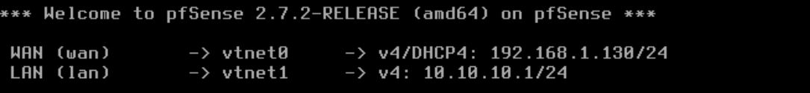

# TP1 - Configuration de pfSense

## Objectif

Mettre en place un routeur pfSense fonctionnel dans un réseau local avec plusieurs interfaces réseaux, une interface d'administration, un LAN, et une machine cliente Kali pour tester la connectivité et les règles de pare-feu.

---

## Infrastructure mise en place

* **lubuntu** (serveur apache2 / futur serveur mail)

  * LAN : 10.10.10.10/24
  * Gateway : 10.10.10.1/24

* **pfSense** (routeur virtuel)

  * WAN : 192.168.1.130/24 (connecté à mon réseau domestique)
  * LAN : 10.10.10.1/24

* **Client Kali** (connecté sur LAN pfSense)

  * Adresse IP : 10.10.10.50/24
  * Gateway : 10.10.10.1

* **Interface Web de pfSense**

  * Accessible depuis Kali via : http://10.10.10.1
  * Ou depuis mon réseau domestique en 192.168.1.130
 
  

## Configuration initiale de pfSense

* Assignation des interfaces WAN (vtnet0) et LAN (vtnet1)
* Attribution manuelle des IP
* Désactivation du DHCP sur WAN
* Activation du DHCP sur LAN
* Test de ping entre pfSense → Kali et Kali → pfSense

## Configuration des règles de pare-feu

### Règles WAN

* Autorisation des connexions entrantes sur HTTP/HTTPS depuis le réseau domestique

### Règles LAN

* Accès total sortant depuis LAN (par défaut)

## Test de connectivité

Depuis Kali (10.10.10.50) :

* Accès à l'interface web de pfSense : OK
* Ping vers 192.168.1.33 (réseau domestique) : OK

## Sécurisation et mot de passe

* Modification du mot de passe admin de pfSense (alerte rouge résolue)

## Conclusion

TP1 posait les bases : installation, réseaux LAN/WAN, règles de pare-feu, et connectivité entre Kali et le monde extérieur via pfSense. C'est le socle pour les TP suivants sur le mail (TP2) et le VPN (TP3).
