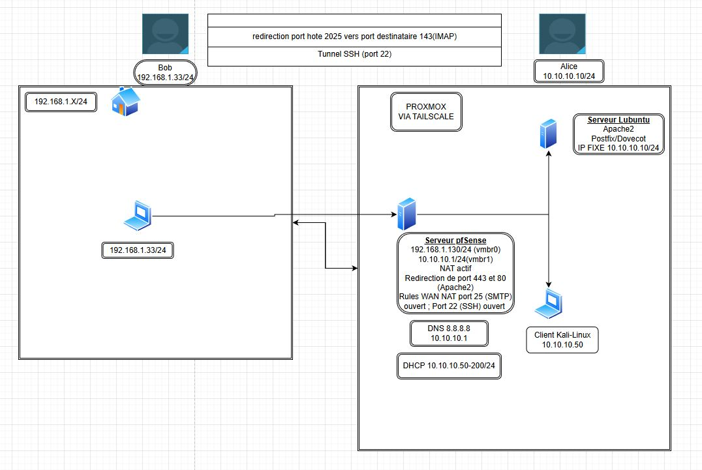

# TP2 - Mise en place d'un serveur de messagerie sécurisé

## Objectif

Mettre en place un serveur de messagerie interne sécurisé avec Postfix, Dovecot, accès IMAP chiffré, tunnelisation SSH et chiffrement des e-mails via GPG, dans une infrastructure préexistante basée sur pfSense.




---

## Prérequis

* Serveur Lubuntu (LAN 10.10.10.10) avec Postfix et Dovecot
* Domaine local : `cs.cr`
* Utilisateurs : Alice et Bob
* Client distant Kali Linux (10.10.10.50)
* pfSense pour la redirection de ports (443, 80, 25, 22)

---

## 1. Installation et configuration de Postfix (mode "Site Internet")

```bash
sudo apt install postfix mailutils
```

* Choisir le mode "Site Internet"
* Domaine : `cs.cr`

### Fichier /etc/postfix/main.cf

* `myhostname = eliott1.cs.cr`
* `mydomain = cs.cr`
* `mynetworks = 127.0.0.0/8, 10.10.10.0/24, 192.168.1.0/24`
* `inet_interfaces = all`

.JPG)

Redémarrage :

```bash
systemctl restart postfix && systemctl enable postfix
```

---

## 2. Création des utilisateurs et test d'envoi SMTP

```bash
adduser alice
adduser bob
```

### Envoi via `mail` ou `telnet`

.JPG)


```bash
telnet 127.0.0.1 25
EHLO
MAIL FROM:<root@cs.cr>
RCPT TO:<alice@cs.cr>
DATA
Subject: Test
Bonjour Alice
.
QUIT
```

Vérification dans `/var/mail/alice` ou via `su - alice && mail`

.JPG)

---

## 3. Aliases mail

Modifier `/etc/aliases` :

```ini
Darksasuke: alice
```

Puis : `newaliases`


.JPG)
.JPG)

---

## 4. Envoi depuis Kali (autre machine LAN)

Installation et configuration de `ssmtp` :

```bash
sudo apt install ssmtp
sudo nano /etc/ssmtp/ssmtp.conf
```

Extrait de configuration :

```ini
mailhub=10.10.10.10:25
rewriteDomain=cs.cr
hostname=kali.cs.cr
```

.JPG)


Ajout dans `/etc/hosts` : `10.10.10.10 cs.cr`
Test via `telnet 10.10.10.10 25`

.JPG)
.JPG)

---

## 5. Installation de Dovecot et accès IMAP

```bash
apt install dovecot-core dovecot-imapd
systemctl enable --now dovecot
```

Vérifier que le port 143 est à l'écoute

---

## 6. Activation de TLS pour IMAP (STARTTLS)

Fichier `/etc/dovecot/conf.d/10-ssl.conf` :

.JPG)


```ini
ssl = yes
ssl_cert = </etc/ssl/certs/ssl-cert-snakeoil.pem
ssl_key = </etc/ssl/private/ssl-cert-snakeoil.key
```

Tester :

```bash
openssl s_client -connect localhost:143 -starttls imap
```

Puis : `a LOGIN alice motdepasse`

.JPG)

---

## 7. Configuration Thunderbird (client graphique)

Sur Kali :

```bash
apt install thunderbird
```

Configurer le compte :

* Serveur entrant : `localhost`, Port `2023`
* Sécurité : STARTTLS
* Utilisateur : `alice@cs.cr`
* 
.JPG)

---

## 8. Accès WAN et tunnel SSH

Redirection de ports via pfSense :

* 25 vers 10.10.10.10:25 (SMTP)
* 22 vers 10.10.10.10:22 (SSH)

Test SSH depuis le WAN :

```bash
ssh -L 2023:localhost:143 alice@192.168.1.130
```

.JPG)


Wireshark : tout le trafic IMAP est encapsulé dans SSH (port 22)

.JPG)

---

## 9. Chiffrement des mails avec GnuPG

### Génération des paires de clés

```bash
gpg --full-generate-key
```
.JPG)


Puis création d'un certificat de révocation :

```bash
gpg --output revoke.asc --gen-revoke alice@cs.cr
```

### Export et import des clés publiques

```bash
gpg --export -a alice@cs.cr > alice_pub.asc
gpg --import bob_pub.asc
```
.JPG)
.JPG)


### Envoi d'un message chiffré

```bash
gpg --output secret.txt.gpg --encrypt --recipient alice@cs.cr secret.txt
```
.JPG)

Envoi avec ssmtp ou Thunderbird en pièce jointe

.JPG)

### Déchiffrement

```bash
gpg --output msg.txt --decrypt secret.txt.gpg
```
.JPG)


### Signature de message

```bash
gpg --clearsign signer.txt
```
.JPG)
.JPG)


Et vérification : `gpg --verify signer.txt.asc`

.JPG)
.JPG)
.JPG)
.JPG)

---

## Conclusion

Ce TP montre une chaîne complète de messagerie interne chiffrée :

* Transmission SMTP locale via Postfix
* Récupération sécurisée via IMAP + TLS avec Dovecot
* Accès à distance sécurisé via tunnel SSH
* Chiffrement de bout en bout grâce à GPG

Il constitue une base pratique de messagerie confidentielle adaptée aux environnements LAN sécurisés.
